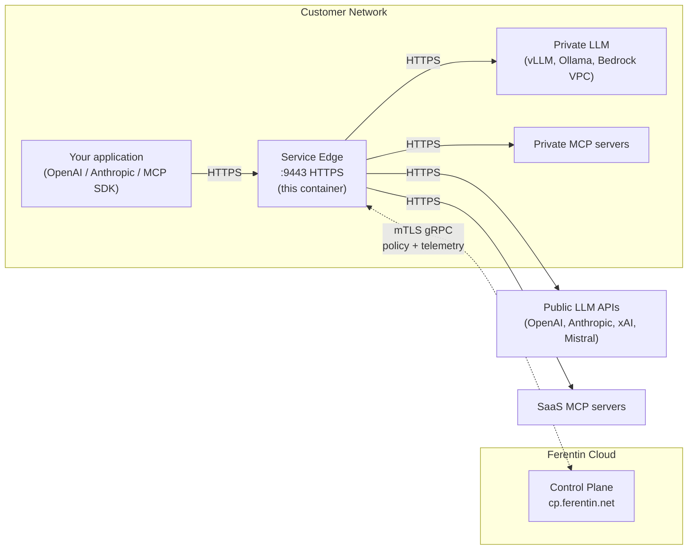

# Ferentin Service Edge

Deployment configurations for Ferentin Service Edge - a hardened LLM gateway container for edge deployments.

## Overview

Service Edge is a secure, production-ready container that provides:

- **OpenAI-compatible LLM proxy** — `/v1/chat/completions`, `/v1/messages`, `/v1/models`, `/v1/embeddings` — drop-in for the OpenAI / Anthropic SDK with policy-driven routing across OpenAI, Anthropic, Azure OpenAI, AWS Bedrock, Google Vertex AI, Google AI Studio, xAI, Mistral, and self-hosted endpoints (vLLM, Ollama).
- **MCP Gateway** — `/v1/mcp/{server-slug}` — proxies [Model Context Protocol](https://modelcontextprotocol.io) tool calls to upstream MCP servers (private or SaaS) with tenant-scoped authorization, session management, and per-tool audit logging. Streamable HTTP transport ([2025-11-25 spec](https://modelcontextprotocol.io/specification/2025-11-25)).
- **Policy enforcement** — every LLM call and every MCP tool invocation is authorized against the policy bundle before execution; deny by default.
- **Automatic certificate management** — bootstrap enrollment issues mTLS client cert (for control-plane comms) and TLS server cert (for the 9443 HTTPS listener); automatic renewal before expiry.
- **Direct telemetry export** — structured audit events streamed to the control plane via mTLS gRPC; zero sampling.
- **Capability gating** — what each edge exposes (LLM, MCP, or both) is controlled by the enrollment token's `capabilities` claim, not environment variables.

## Architecture at a glance



The edge sits between your application and upstream services. Workload data (LLM prompts, MCP tool calls, responses) flows through the edge but stays inside your network whenever the destination does — only policy bundles (in) and audit telemetry (out) travel over the mTLS gRPC channel to the Ferentin Cloud.

## Container Images

| Registry | Image |
|----------|-------|
| GitHub Container Registry | `ghcr.io/ferentin-net/service-edge:<version>` |
| Amazon ECR | `089534985149.dkr.ecr.us-east-1.amazonaws.com/ferentin/service-edge:<version>` |

> **Pin to a specific version** (e.g., `service-edge:1.2.3`). Avoid using `:latest` in production — it makes deployments non-deterministic, complicates rollbacks, and may pull breaking changes. See [releases](https://github.com/ferentin-net/service-edge/releases) for available versions.

## Security Features

The Service Edge image is hardened with:

- Read-only root filesystem
- Non-root user (UID 1000)
- No package manager in runtime
- setuid/setgid bits removed
- Cosign-signed images
- Ubuntu Noble (glibc) base image

## Quick Start

### 1. Get an Enrollment Token

1. Log into the [Ferentin Admin Console](https://admin.ferentin.net)
2. Navigate to **Edge Nodes** > **Add Edge Node**
3. Copy the enrollment token

### 2. Deploy with Docker

```bash
# Create persistent volumes
docker volume create service-edge-certs
docker volume create service-edge-policy

# Fix volume permissions for the non-root UID 1000 in the image
docker run --rm \
  -v service-edge-certs:/opt/ferentin/certs \
  -v service-edge-policy:/opt/ferentin/policy \
  alpine:latest chown -R 1000:1000 /opt/ferentin/certs /opt/ferentin/policy

# Generate a passphrase for private key encryption (store this securely!)
export FERENTIN_KEY_PASSPHRASE=$(openssl rand -base64 48)
echo "Save this passphrase — if lost, the edge must re-enroll:"
echo "$FERENTIN_KEY_PASSPHRASE"

# Run — bootstrap auto-triggers on first run when ENROLLMENT_TOKEN is set
# and no certs exist on the volume; on subsequent restarts the token is
# ignored and the edge uses the persisted certs.
docker run -d \
  --name service-edge \
  --read-only \
  -v service-edge-certs:/opt/ferentin/certs:rw \
  -v service-edge-policy:/opt/ferentin/policy:rw \
  --tmpfs /opt/ferentin/logs:rw,uid=1000,gid=1000,noexec,nosuid,size=100m \
  --tmpfs /opt/ferentin/data:rw,uid=1000,gid=1000,noexec,nosuid,size=50m \
  --tmpfs /opt/ferentin/tmp:rw,uid=1000,gid=1000,noexec,nosuid,size=100m \
  -p 9443:9443 \
  -e ENROLLMENT_TOKEN=your-enrollment-token-here \
  -e FERENTIN_KEY_PASSPHRASE="$FERENTIN_KEY_PASSPHRASE" \
  -e SPRING_PROFILES_ACTIVE=aws-secure \
  --security-opt no-new-privileges:true \
  --cap-drop ALL \
  ghcr.io/ferentin-net/service-edge:0.4.0  # Pin to a specific version
```

> **Don't set `TENANT_ID`, `SITE_ID`, or `EDGE_ID` as environment variables.** They're derived from the enrollment token's JWT claims (`tid`, `site_id`, `edge_type`). Any env var that disagrees with the token aborts startup.

### 3. Verify Enrollment

The HTTP listener (9080) binds at process start. The HTTPS listener (9443) binds **after** bootstrap completes — it needs the server cert in hand before opening a TLS socket. Expect `9443` to come up a few seconds after the container starts on first run.

```bash
# Health check on the HTTP listener (binds immediately at startup)
curl http://localhost:9080/actuator/health

# Confirm the TLS listener is up — look for the bind log line
docker logs service-edge 2>&1 | grep TlsListenerService
# Expected: "TLS HTTPS listener bound on port 9443 (reason: certificates-available)"
# (or "application-ready" on warm restarts)

# Test LLM API over TLS (after the bind log line above appears)
curl https://localhost:9443/v1/models

# Test MCP Gateway (if the enrollment token has the mcp capability)
curl -X POST https://localhost:9443/v1/mcp/<server-slug> \
  -H "Authorization: Bearer $TOKEN" \
  -H "Content-Type: application/json" \
  -d '{"jsonrpc":"2.0","id":1,"method":"tools/list"}'
```

## Ports

| Port | Protocol | Purpose | Exposure |
|------|----------|---------|----------|
| 9443 | HTTPS | LLM API endpoints (primary) | External |
| 9080 | HTTP | Health checks, actuator only | Internal only |

Port 9443 is the primary API port for all LLM traffic. It activates automatically once server certificates are provisioned during bootstrap enrollment. Port 9080 is restricted to health checks and actuator endpoints — LLM API endpoints (`/v1/chat/completions`, `/v1/messages`, etc.) are blocked on this port.

## Deployment Guides

| Platform | Guide |
|----------|-------|
| Docker Compose | [docker-compose/](docker-compose/) |
| Kubernetes | [kubernetes/](kubernetes/) |
| Helm | [helm/service-edge/](helm/service-edge/) |
| AWS ECS | [aws-ecs/](aws-ecs/) |
| Fly.io | [fly.io/](fly.io/) |
| Railway | [railway/](railway/) |
| Render | [render/](render/) |

### Multi-Instance and TLS

For high availability, deploy multiple Service Edge instances behind a load balancer. See [TLS.md](TLS.md) for:
- How server and client certificates work
- Load balancer configuration (Nginx, HAProxy, Caddy, Envoy, ALB)
- End-to-end encryption setup
- Multi-instance Docker Compose example

## Required Volumes

| Path | Purpose | Type | Persistence |
|------|---------|------|-------------|
| `/opt/ferentin/certs` | mTLS certificates | Persistent | **Required** |
| `/opt/ferentin/policy` | Policy bundles | Persistent | Recommended |
| `/opt/ferentin/logs` | Application logs | tmpfs/Persistent | Optional |
| `/opt/ferentin/data` | Runtime data | tmpfs/Persistent | Optional |
| `/opt/ferentin/tmp` | Java temp files | tmpfs | Ephemeral |

## Environment Variables

### Bootstrap Configuration

| Variable | Required | Default | Description |
|----------|----------|---------|-------------|
| `ENROLLMENT_TOKEN` | Yes (first run) | - | JWT enrollment token from admin console. Single-use, 15-min TTL by default. Bootstrap auto-triggers when this is present and no certs are on the volume; on warm restarts the token is harmless (the runner short-circuits on valid certs). After enrollment you can leave it in the env or remove it. |
| `SPRING_PROFILES_ACTIVE` | No | `aws-secure` | Spring profile for configuration. `aws-secure` for production, `nginx` for local development against a self-hosted control plane. |
| `BOOTSTRAP_ENABLED` | No | `true` | Kill-switch. Set to `false` to suppress bootstrap (e.g., a debugging container that should never enroll). Operators should not set this in normal use — bootstrap is gated by `ENROLLMENT_TOKEN` presence and on-disk cert state. |
| `BOOTSTRAP_FORCE` | No | `false` | Force re-enrollment even when valid certs exist. Used during recovery scenarios. |

> **Identity is derived from the JWT, not from environment variables.** Tenant ID, site ID, edge ID, and edge type all come from the enrollment token's claims (`tid`, `site_id`, `edge_id`, `edge_type`). Setting `TENANT_ID`, `SITE_ID`, or `EDGE_ID` as env vars is unnecessary and a mismatch with the token aborts startup.

### Security Configuration

| Variable | Required | Default | Description |
|----------|----------|---------|-------------|
| `FERENTIN_KEY_PASSPHRASE` | **Yes** | - | Passphrase for private key encryption at rest (minimum 32 characters). Protects `client.key` and `server.key` on disk using AES-256-GCM. Generate **once** with `openssl rand -base64 48` and store securely. Must be the same value on every restart — if lost, the edge must re-enroll. |
| `FERENTIN_KEY_PASSPHRASE_OLD` | No | - | Set alongside `FERENTIN_KEY_PASSPHRASE` to rotate the passphrase. See [Passphrase Rotation](#passphrase-rotation). |

### TLS Configuration

| Variable | Required | Default | Description |
|----------|----------|---------|-------------|
| `TLS_ENABLED` | No | `true` | Enable HTTPS listener on port 9443 |
| `TLS_PORT` | No | `9443` | HTTPS listener port |

### Runtime Configuration

| Variable | Required | Default | Description |
|----------|----------|---------|-------------|
| `JAVA_OPTS` | No | See docs | Additional JVM options |
| `ENABLE_VIRTUAL_THREADS` | No | `false` | Enable Java 25 virtual threads |
| `EDGE_CA_BUNDLE` | No | - | Custom CA bundle (PEM format) |

## Health Checks

| Endpoint | Purpose |
|----------|---------|
| TCP 9080 | Basic liveness |
| `/actuator/health` | Full health status |
| `/actuator/health/liveness` | Kubernetes liveness probe |
| `/actuator/health/readiness` | Kubernetes readiness probe |

## API Endpoints

Once enrolled, Service Edge exposes APIs on port **9443** (TLS). Which capabilities are active depends on the enrollment token — the `capabilities` claim controls whether LLM and/or MCP endpoints are enabled.

### OpenAI-Compatible

| Endpoint | Method | Description |
|----------|--------|-------------|
| `/v1/chat/completions` | POST | Chat completions API |
| `/v1/models` | GET | List available models |
| `/v1/embeddings` | POST | Embeddings API |

### Anthropic-Compatible

| Endpoint | Method | Description |
|----------|--------|-------------|
| `/v1/messages` | POST | Messages API (Claude) |

### MCP Gateway

The MCP Gateway proxies [MCP (Model Context Protocol)](https://modelcontextprotocol.io) requests to upstream MCP servers with tenant-scoped policy enforcement, session management, and audit logging.

| Endpoint | Method | Description |
|----------|--------|-------------|
| `/v1/mcp/{server-slug}` | POST | MCP JSON-RPC 2.0 endpoint (Streamable HTTP transport) |
| `/.well-known/oauth-protected-resource/v1/mcp` | GET | OAuth2 Protected Resource Metadata ([RFC 9728](https://www.rfc-editor.org/rfc/rfc9728)) |
| `/v1/mcp/.well-known/oauth-protected-resource` | GET | PRM discovery (alternative path) |

**Route pattern**: `https://<edge-host>:9443/v1/mcp/{server-slug}`

- `{server-slug}` identifies the upstream MCP server (e.g., `github`, `slack`, `stripe`)
- Available server slugs are defined in the tenant's policy bundle
- Requires a Bearer token with `mcp` scope (issued by the Ferentin authorization server)
- Supports `MCP-Session-Id` header for session continuity

**Supported JSON-RPC methods**: `initialize`, `tools/list`, `tools/call`, `ping`, `notifications/initialized`

**Example — List tools on a GitHub MCP server**:
```bash
curl -X POST https://localhost:9443/v1/mcp/github \
  -H "Authorization: Bearer $TOKEN" \
  -H "Content-Type: application/json" \
  -d '{"jsonrpc":"2.0","id":1,"method":"tools/list"}'
```

**Example — Call a tool**:
```bash
curl -X POST https://localhost:9443/v1/mcp/github \
  -H "Authorization: Bearer $TOKEN" \
  -H "MCP-Session-Id: $SESSION_ID" \
  -H "Content-Type: application/json" \
  -d '{"jsonrpc":"2.0","id":2,"method":"tools/call","params":{"name":"get_user_profile","arguments":{}}}'
```

### Capability Activation

LLM and MCP capabilities are controlled by the enrollment token, not environment variables. When creating an enrollment token in the admin console, select which capabilities to enable:

| Capability | Enrollment Claim | Endpoints Enabled |
|------------|-----------------|-------------------|
| `llm` | `capabilities.llm: true` | `/v1/chat/completions`, `/v1/messages`, `/v1/models`, `/v1/embeddings` |
| `mcp` | `capabilities.mcp: true` | `/v1/mcp/{server-slug}`, MCP discovery endpoints |

## Passphrase Rotation

To change the `FERENTIN_KEY_PASSPHRASE` without re-enrolling the edge:

1. Generate a new passphrase:
   ```bash
   export NEW_PASSPHRASE=$(openssl rand -base64 48)
   echo "New passphrase (store securely): $NEW_PASSPHRASE"
   ```

2. Set both the old and new passphrases, then restart:

   **Docker:**
   ```bash
   docker run -d \
     -e FERENTIN_KEY_PASSPHRASE="$NEW_PASSPHRASE" \
     -e FERENTIN_KEY_PASSPHRASE_OLD="$OLD_PASSPHRASE" \
     ...
   ```

   **Kubernetes:**
   ```bash
   kubectl create secret generic service-edge-secrets \
     --from-literal=key-passphrase="$NEW_PASSPHRASE" \
     --from-literal=key-passphrase-old="$OLD_PASSPHRASE" \
     --dry-run=client -o yaml | kubectl apply -f -
   kubectl rollout restart deployment/service-edge
   ```

   **Fly.io:**
   ```bash
   fly secrets set FERENTIN_KEY_PASSPHRASE="$NEW_PASSPHRASE" FERENTIN_KEY_PASSPHRASE_OLD="$OLD_PASSPHRASE"
   ```

3. On startup, the edge will:
   - Decrypt `client.key` and `server.key` with the old passphrase
   - Re-encrypt both with the new passphrase
   - Atomically replace the files on disk
   - Continue normal operation with the new passphrase

4. After confirming the edge is running, **remove** `FERENTIN_KEY_PASSPHRASE_OLD` from the environment and restart once more. This is a cleanup step — the edge will operate normally without it.

**Important:**
- The new passphrase must be at least 32 characters
- The new passphrase must differ from the old one
- If rotation fails (e.g., wrong old passphrase), the original files are left intact
- Neither passphrase is logged

## Troubleshooting

### Container fails to start with "directory not mounted"

Ensure all required volumes are mounted:

```bash
docker run --read-only \
  -v service-edge-certs:/opt/ferentin/certs:rw \
  -v service-edge-policy:/opt/ferentin/policy:rw \
  --tmpfs /opt/ferentin/logs:rw,uid=1000,gid=1000 \
  --tmpfs /opt/ferentin/data:rw,uid=1000,gid=1000 \
  --tmpfs /opt/ferentin/tmp:rw,uid=1000,gid=1000 \
  ...
```

### Container fails with "directory not writable"

Fix volume permissions for the non-root user (UID 1000):

```bash
docker run --rm \
  -v service-edge-certs:/opt/ferentin/certs \
  -v service-edge-policy:/opt/ferentin/policy \
  alpine:latest chown -R 1000:1000 /opt/ferentin/certs /opt/ferentin/policy
```


### `curl https://...:9443/...` returns "Connection reset by peer"

The 9443 TLS listener binds **after** bootstrap completes — on a fresh enrollment, expect a few seconds between startup and the listener coming up. If it never comes up, tail the logs:

```bash
docker logs service-edge 2>&1 | grep TlsListenerService
```

Look for one of:

| Log line | Meaning |
|---|---|
| `TLS HTTPS listener bound on port 9443 (reason: certificates-available)` | First-time enrollment — bootstrap just wrote the server cert. Listener is up. |
| `TLS HTTPS listener bound on port 9443 (reason: application-ready)` | Warm restart — server cert was already on the persistent volume. |
| `TLS HTTPS listener bound on port 9443 (reason: certificates-refreshed)` | Cert rotation / re-enrollment. |
| `TLS listener will bind once certificates are provisioned (port 9443)` | Bootstrap hasn't completed yet — wait a few seconds and re-check. |
| `TLS listener disabled — skipping bind` | TLS is turned off (e.g., `TLS_ENABLED=false`). Only the 9080 HTTP listener is up. |
| `Failed to bind TLS listener on port 9443: <error>` | Bind failed — port already taken, cert/key load error, or invalid permissions. Inspect the error message. |

If no `TlsListenerService` lines appear at all, the edge crashed before reaching the TLS-bind path; look earlier in the log for the root cause (likely `EdgeBootstrapClientImpl` or invalid `FERENTIN_KEY_PASSPHRASE`). The 9080 HTTP listener stays up regardless, so `curl http://localhost:9080/actuator/health/liveness` works for diagnosing while 9443 is down.

### Bootstrap enrollment fails

1. Verify the enrollment token is valid (not expired — single-use, 15-min TTL).
2. Check network connectivity to the Ferentin control plane (`cp.ferentin.net:443`).
3. Verify `FERENTIN_KEY_PASSPHRASE` is at least 32 characters and matches the value used at first enrollment (it's required to decrypt the persisted private keys on every start).
4. Review logs: `docker logs service-edge`.

## Support

- [Documentation](https://docs.ferentin.net)
- [Issues](https://github.com/ferentin-net/ferentin-service-edge/issues)
- [Contact Support](mailto:support@ferentin.com)

## License

Proprietary - Ferentin
