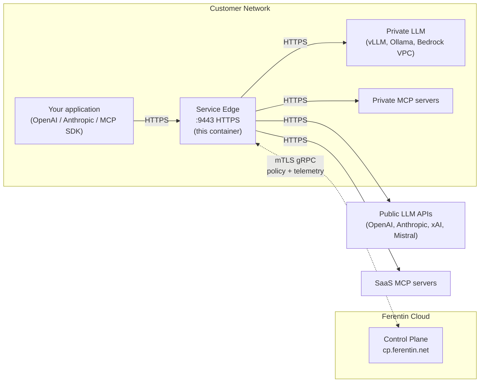

# Ferentin Service Edge

Hardened LLM and MCP gateway container — deployed at the customer edge with policy enforcement, multi-provider routing, and direct mTLS telemetry to the Ferentin control plane.

[](https://github.com/orgs/ferentin-net/packages/container/package/service-edge)
[](https://github.com/orgs/ferentin-net/packages/container/package/service-edge)
[](#security-features)
[](#license)

This repository carries the deployment recipes — Docker Compose, Kubernetes manifests, Helm chart, AWS ECS task definitions, Fly.io / Render / Railway configs — for the `ghcr.io/ferentin-net/service-edge` container.

## Architecture at a glance



The edge sits between your application and upstream services. Workload data (LLM prompts, MCP tool calls, responses) flows through the edge but stays inside your network whenever the destination does — only signed policy bundles (in) and audit telemetry (out) travel over the mTLS gRPC channel to the Ferentin Cloud.

## Features

- **OpenAI / Anthropic-compatible LLM proxy** — `/v1/chat/completions`, `/v1/messages`, `/v1/models`, `/v1/embeddings`. Drop-in for the OpenAI / Anthropic SDK.
- **Multi-provider routing** — policy-driven dispatch across OpenAI, Anthropic, Azure OpenAI, AWS Bedrock, Google Vertex AI, Google AI Studio, xAI, Mistral, and self-hosted endpoints (vLLM, Ollama).
- **MCP Gateway** — `/v1/mcp/{server-slug}` proxies [Model Context Protocol](https://modelcontextprotocol.io) tool calls to upstream MCP servers (private or SaaS) with per-tool authorization. Streamable HTTP transport ([2025-11-25 spec](https://modelcontextprotocol.io/specification/2025-11-25)).
- **Zero-trust enforcement** — every LLM call and every MCP tool invocation is authorized against the policy bundle before execution; deny by default.
- **Automatic certificate management** — bootstrap enrollment issues mTLS client cert (control-plane comms) and HTTPS server cert (port 9443 listener); auto-renewal before expiry.
- **Direct telemetry export** — structured audit events streamed via mTLS gRPC; zero sampling.
- **Capability gating** — what each edge exposes (LLM, MCP, or both) is controlled by the enrollment token's `capabilities` claim, not environment variables.
- **Hardened image** — read-only root filesystem, non-root UID 1000, dropped capabilities, no shell or package manager in the runtime layer, cosign-signed.

## Quick Start

### 1. Get an enrollment token

1. Log into the [Ferentin Admin Console](https://admin.ferentin.net)
2. Navigate to [**Private Edges**](https://admin.ferentin.net/manage/edges) → [**Enroll Edge**](https://admin.ferentin.net/manage/edges/new)
3. Copy the enrollment token (single-use, 15-minute TTL by default)

### 2. Deploy with Docker

```bash
# Create persistent volumes for certs and policy bundle
docker volume create service-edge-certs
docker volume create service-edge-policy

# Fix volume permissions for the non-root UID 1000 in the image
docker run --rm \
  -v service-edge-certs:/opt/ferentin/certs \
  -v service-edge-policy:/opt/ferentin/policy \
  alpine:latest chown -R 1000:1000 /opt/ferentin/certs /opt/ferentin/policy

# Generate a passphrase for at-rest key encryption (store this securely!)
export FERENTIN_KEY_PASSPHRASE=$(openssl rand -base64 48)
echo "Save this passphrase — if lost, the edge must re-enroll:"
echo "$FERENTIN_KEY_PASSPHRASE"

# Run — bootstrap auto-triggers on first run when ENROLLMENT_TOKEN is set
# and no certs exist on the volume; on subsequent restarts the token is
# ignored and the edge uses the persisted certs.
docker run -d \
  --name service-edge \
  --read-only \
  -v service-edge-certs:/opt/ferentin/certs:rw \
  -v service-edge-policy:/opt/ferentin/policy:rw \
  --tmpfs /opt/ferentin/logs:rw,uid=1000,gid=1000,noexec,nosuid,size=100m \
  --tmpfs /opt/ferentin/data:rw,uid=1000,gid=1000,noexec,nosuid,size=50m \
  --tmpfs /opt/ferentin/tmp:rw,uid=1000,gid=1000,noexec,nosuid,size=100m \
  -p 9443:9443 \
  -e ENROLLMENT_TOKEN=your-enrollment-token-here \
  -e FERENTIN_KEY_PASSPHRASE="$FERENTIN_KEY_PASSPHRASE" \
  -e SPRING_PROFILES_ACTIVE=aws-secure \
  --security-opt no-new-privileges:true \
  --cap-drop ALL \
  ghcr.io/ferentin-net/service-edge:0.4.1
```

### 3. Verify enrollment

The HTTP listener (9080) binds at process start. The HTTPS listener (9443) binds **after** bootstrap completes — it needs the server cert in hand before opening a TLS socket. Expect 9443 to come up a few seconds after the container starts on first run.

```bash
# Health check on the HTTP listener (binds immediately at startup)
curl http://localhost:9080/actuator/health

# Confirm the TLS listener is up — look for the bind log line
docker logs service-edge 2>&1 | grep TlsListenerService
# Expected: "TLS HTTPS listener bound on port 9443 (reason: certificates-available)"
# (or "application-ready" on warm restarts)

# Test the LLM API over TLS (after the bind log line above appears)
curl https://localhost:9443/v1/models

# Test the MCP Gateway (if the enrollment token has the mcp capability)
curl -X POST https://localhost:9443/v1/mcp/<server-slug> \
  -H "Authorization: Bearer $TOKEN" \
  -H "Content-Type: application/json" \
  -d '{"jsonrpc":"2.0","id":1,"method":"tools/list"}'
```

## Container Image

| Registry | Image |
|---|---|
| GitHub Container Registry | `ghcr.io/ferentin-net/service-edge` |
| Amazon ECR | `089534985149.dkr.ecr.us-east-1.amazonaws.com/ferentin/service-edge` |

**Architectures**: `linux/amd64`, `linux/arm64` (manifest list — Docker pulls the right variant automatically).

### Available tags

The image publishes several tag granularities; pick the one that matches your update tolerance:

| Tag | Example | When it moves |
|---|---|---|
| Exact | `service-edge:0.4.0` | Never. **Recommended for production.** |
| Minor | `service-edge:0.4` | When a patch ships (e.g., 0.4.1). |
| Major | `service-edge:0` | When a minor ships (e.g., 0.5.0). |
| Floating | `service-edge:latest` | Every release. Avoid in production. |
| Digest | `service-edge@sha256:...` | Never. Strongest pin. Recommended with image-signing verification. |
| Commit | `service-edge:sha-<short>` | Never. One per source commit; useful for tracing back to source. |

Browse all published versions on the [GHCR package page](https://github.com/orgs/ferentin-net/packages/container/package/service-edge).

> **Pin to a specific version in production.** `:latest` is a moving tag — it makes deployments non-deterministic and rollbacks ambiguous.

### Verifying image signatures

Images are signed with [cosign](https://github.com/sigstore/cosign) using GitHub's OIDC keyless flow:

```bash
cosign verify ghcr.io/ferentin-net/service-edge:0.4.1 \
  --certificate-identity-regexp 'https://github.com/ferentin-net/ferentin-platform/.+' \
  --certificate-oidc-issuer https://token.actions.githubusercontent.com
```

Successful verification looks like:

```
Verification for ghcr.io/ferentin-net/service-edge:0.4.0 --
The following checks were performed on each of these signatures:
  - The cosign claims were validated
  - Existence of the claims in the transparency log was verified offline
  - The code-signing certificate was verified using trusted certificate authority certificates

[{"critical":{"identity":{"docker-reference":"ghcr.io/ferentin-net/service-edge:0.4.0"},"image":{"docker-manifest-digest":"sha256:d805674eae5a9a845d7e0827e3220fae008e3fcdd686631c8e7448d54eadb3f7"},"type":"https://sigstore.dev/cosign/sign/v1"},"optional":{}}]
```

## Deployment Guides

| Platform | Guide |
|---|---|
| Docker Compose | [docker-compose/](docker-compose/) |
| Kubernetes | [kubernetes/](kubernetes/) |
| Helm | [helm/service-edge/](helm/service-edge/) |
| AWS ECS (Fargate / EC2) | [aws-ecs/](aws-ecs/) |
| Fly.io | [fly.io/](fly.io/) |
| Railway | [railway/](railway/) |
| Render | [render/](render/) |

For multi-instance deployments behind a load balancer (Nginx, HAProxy, Caddy, Envoy, AWS ALB), see [TLS.md](TLS.md) — covers end-to-end encryption, backend cert verification, and multi-instance topology.

## Configuration

### Required volumes

| Path | Purpose | Type | Persistence |
|---|---|---|---|
| `/opt/ferentin/certs` | mTLS certs + encrypted private keys | Persistent | **Required** — losing this means re-enrollment |
| `/opt/ferentin/policy` | Policy bundle cache | Persistent | Recommended (recoverable on cold start, but adds latency) |
| `/opt/ferentin/logs` | Audit log buffer (gRPC export source) | tmpfs OK | Ephemeral |
| `/opt/ferentin/data` | Runtime state | tmpfs OK | Ephemeral |
| `/opt/ferentin/tmp` | Working scratch space | tmpfs OK | Ephemeral |

The image runs as non-root UID 1000. Persistent volumes need `chown -R 1000:1000` (Docker) or `fsGroup: 1000` (Kubernetes).

### Bootstrap and identity

| Variable | Required | Default | Description |
|---|---|---|---|
| `ENROLLMENT_TOKEN` | Yes (first run) | — | JWT enrollment token from admin console. Single-use, 15-min TTL. Bootstrap auto-triggers when set and no certs are on the volume; on warm restarts the token is harmless (the runner short-circuits on valid certs). |
| `BOOTSTRAP_ENABLED` | No | `true` | Kill-switch only. Set to `false` to suppress bootstrap entirely. Operators should not flip this in normal use. |
| `BOOTSTRAP_FORCE` | No | `false` | Force re-enrollment even when valid certs exist. Used during recovery. |

### Security

| Variable | Required | Default | Description |
|---|---|---|---|
| `FERENTIN_KEY_PASSPHRASE` | **Yes** | — | Passphrase for at-rest key encryption (min 32 chars). Protects `client.key` and `server.key` on disk using AES-256-GCM. Generate **once** with `openssl rand -base64 48`; store in your secret manager. **Lose it and you must re-enroll.** |
| `FERENTIN_KEY_PASSPHRASE_OLD` | No | — | Set alongside `FERENTIN_KEY_PASSPHRASE` to rotate. See [Passphrase rotation](#passphrase-rotation). |

### TLS listener

| Variable | Required | Default | Description |
|---|---|---|---|
| `TLS_ENABLED` | No | `true` | Enable HTTPS listener on port 9443. |
| `TLS_PORT` | No | `9443` | HTTPS listener port. |
| `TLS_PORT_FILTERING_ENABLED` | No | `true` | Block LLM / MCP endpoints on the 9080 HTTP listener. Set `false` only when a trusted proxy terminates TLS upstream of the container (Fly.io, Render, Railway). |

### Runtime

| Variable | Required | Default | Description |
|---|---|---|---|
| `JAVA_OPTS` | No | — | Additional JVM options. |
| `ENABLE_VIRTUAL_THREADS` | No | `false` | Enable Java 25 virtual threads. |
| `EDGE_CA_BUNDLE` | No | — | Custom CA bundle (PEM format) for trusting self-signed control planes in dev. |

### Ports

| Port | Protocol | Purpose | Exposure |
|---|---|---|---|
| 9443 | HTTPS | LLM and MCP API (primary). Binds **after** bootstrap completes. | External |
| 9080 | HTTP | Health checks and actuator only. Binds at startup; LLM/MCP endpoints are blocked here unless `TLS_PORT_FILTERING_ENABLED=false`. | Internal |

## Endpoints

Once enrolled, Service Edge exposes APIs on port **9443** (HTTPS). Which capabilities are active depends on the enrollment token's `capabilities` claim.

### LLM Proxy

| Endpoint | Method | Description |
|---|---|---|
| `/v1/chat/completions` | POST | OpenAI-compatible chat completions |
| `/v1/messages` | POST | Anthropic-compatible Messages API |
| `/v1/models` | GET | List available models for this tenant |
| `/v1/embeddings` | POST | Embeddings API |

### MCP Gateway

The MCP Gateway proxies [MCP](https://modelcontextprotocol.io) requests to upstream MCP servers with tenant-scoped policy enforcement, session management, and per-tool audit logging.

| Endpoint | Method | Description |
|---|---|---|
| `/v1/mcp/{server-slug}` | POST | MCP JSON-RPC 2.0 endpoint (Streamable HTTP transport) |
| `/.well-known/oauth-protected-resource/v1/mcp` | GET | OAuth2 Protected Resource Metadata ([RFC 9728](https://www.rfc-editor.org/rfc/rfc9728)) |
| `/v1/mcp/.well-known/oauth-protected-resource` | GET | PRM discovery (alternative path) |

`{server-slug}` identifies the upstream MCP server (e.g., `github`, `slack`, `stripe`). Available slugs are defined in the tenant's policy bundle. Requires a Bearer token with `mcp` scope and supports `MCP-Session-Id` for session continuity.

**Supported JSON-RPC methods**: `initialize`, `tools/list`, `tools/call`, `ping`, `notifications/initialized`.

**Example — list tools on a GitHub MCP server**:

```bash
curl -X POST https://localhost:9443/v1/mcp/github \
  -H "Authorization: Bearer $TOKEN" \
  -H "Content-Type: application/json" \
  -d '{"jsonrpc":"2.0","id":1,"method":"tools/list"}'
```

**Example — call a tool**:

```bash
curl -X POST https://localhost:9443/v1/mcp/github \
  -H "Authorization: Bearer $TOKEN" \
  -H "MCP-Session-Id: $SESSION_ID" \
  -H "Content-Type: application/json" \
  -d '{"jsonrpc":"2.0","id":2,"method":"tools/call","params":{"name":"get_user_profile","arguments":{}}}'
```

### Capability activation

| Capability | Enrollment claim | Endpoints enabled |
|---|---|---|
| `llm` | `capabilities.llm: true` | `/v1/chat/completions`, `/v1/messages`, `/v1/models`, `/v1/embeddings` |
| `mcp` | `capabilities.mcp: true` | `/v1/mcp/{server-slug}`, MCP discovery endpoints |

### Health checks

| Endpoint | Purpose |
|---|---|
| TCP 9080 | Basic liveness |
| `/actuator/health` | Full health status |
| `/actuator/health/liveness` | Kubernetes liveness probe |
| `/actuator/health/readiness` | Kubernetes readiness probe (initial bundle loaded, mTLS enrolled) |
| `/actuator/prometheus` | Prometheus metrics |

## Operations

### Passphrase rotation

To change `FERENTIN_KEY_PASSPHRASE` without re-enrolling:

1. Generate a new passphrase:
   ```bash
   export NEW_PASSPHRASE=$(openssl rand -base64 48)
   echo "New passphrase (store securely): $NEW_PASSPHRASE"
   ```

2. Set both old and new, then restart:

   **Docker:**
   ```bash
   docker run -d \
     -e FERENTIN_KEY_PASSPHRASE="$NEW_PASSPHRASE" \
     -e FERENTIN_KEY_PASSPHRASE_OLD="$OLD_PASSPHRASE" \
     ...
   ```

   **Kubernetes:**
   ```bash
   kubectl create secret generic service-edge-secrets \
     --from-literal=key-passphrase="$NEW_PASSPHRASE" \
     --from-literal=key-passphrase-old="$OLD_PASSPHRASE" \
     --dry-run=client -o yaml | kubectl apply -f -
   kubectl rollout restart deployment/service-edge
   ```

   **Fly.io:**
   ```bash
   fly secrets set FERENTIN_KEY_PASSPHRASE="$NEW_PASSPHRASE" FERENTIN_KEY_PASSPHRASE_OLD="$OLD_PASSPHRASE"
   ```

3. On startup the edge decrypts `client.key` and `server.key` with the old passphrase, re-encrypts both with the new passphrase, and atomically replaces the files on disk.

4. After confirming the edge is running, **remove** `FERENTIN_KEY_PASSPHRASE_OLD` and restart once more.

**Important:**
- The new passphrase must be at least 32 characters and differ from the old one.
- If rotation fails (e.g., wrong old passphrase), the original files are left intact.
- Neither passphrase is logged.

### Re-enrollment

If certs are revoked or the cert volume is lost, re-enroll:

1. Obtain a fresh enrollment token from the admin console.
2. Set `BOOTSTRAP_FORCE=true` to bypass the on-disk-cert short-circuit.
3. Restart the container.
4. After successful re-enrollment, remove `BOOTSTRAP_FORCE` from the env.

## Troubleshooting

### `curl https://...:9443/...` returns "Connection reset by peer"

The 9443 TLS listener binds **after** bootstrap completes — on a fresh enrollment, expect a few seconds between startup and the listener coming up. Tail the logs:

```bash
docker logs service-edge 2>&1 | grep TlsListenerService
```

| Log line | Meaning |
|---|---|
| `TLS HTTPS listener bound on port 9443 (reason: certificates-available)` | First-time enrollment — bootstrap just wrote the server cert. Listener is up. |
| `TLS HTTPS listener bound on port 9443 (reason: application-ready)` | Warm restart — server cert was already on the persistent volume. |
| `TLS HTTPS listener bound on port 9443 (reason: certificates-refreshed)` | Cert rotation / re-enrollment. |
| `TLS listener will bind once certificates are provisioned (port 9443)` | Bootstrap hasn't completed yet — wait a few seconds and re-check. |
| `TLS listener disabled — skipping bind` | TLS is turned off (e.g., `TLS_ENABLED=false`). |
| `Failed to bind TLS listener on port 9443: <error>` | Bind failed — port already taken, cert/key load error, or invalid permissions. |

If no `TlsListenerService` lines appear at all, the edge crashed before reaching the TLS-bind path; look earlier in the log for the root cause (likely `EdgeBootstrapClientImpl` or invalid `FERENTIN_KEY_PASSPHRASE`). The 9080 HTTP listener stays up regardless, so `curl http://localhost:9080/actuator/health/liveness` works for diagnosing while 9443 is down.

### Container fails with "directory not writable"

Fix volume permissions for the non-root UID 1000:

```bash
docker run --rm \
  -v service-edge-certs:/opt/ferentin/certs \
  -v service-edge-policy:/opt/ferentin/policy \
  alpine:latest chown -R 1000:1000 /opt/ferentin/certs /opt/ferentin/policy
```

On Kubernetes, set `fsGroup: 1000` on the pod's `securityContext`.

### Bootstrap enrollment fails

1. Verify the enrollment token is valid (single-use, 15-min TTL by default).
2. Check network connectivity to the Ferentin control plane (`cp.ferentin.net:443`).
3. Verify `FERENTIN_KEY_PASSPHRASE` is at least 32 characters and matches the value used at first enrollment (it's required to decrypt persisted private keys on every start).
4. Review logs: `docker logs service-edge`.

## Security Features

The image is hardened with:

- Read-only root filesystem (`--read-only` in Docker, `readOnlyRootFilesystem: true` in Kubernetes)
- Non-root user (UID 1000)
- All Linux capabilities dropped (`--cap-drop ALL`)
- `no-new-privileges` enforced
- No package manager or shell utilities in the runtime layer
- `setuid` / `setgid` bits stripped from binaries
- Cosign-signed images (keyless, GitHub OIDC); see [Verifying image signatures](#verifying-image-signatures)
- Ubuntu Noble (glibc) base image, regularly rebuilt for CVE patches

End-to-end TLS for workload traffic: clients reach the edge over HTTPS (port 9443) using the Ferentin-issued server cert, and the edge re-encrypts when calling upstream LLMs and MCP servers. There is no plaintext hop. See [TLS.md](TLS.md) for load-balancer topologies.

## Support

- [Documentation](https://docs.ferentin.net) — full operator guides, including the [Service Edge — Getting Started](https://docs.ferentin.net/docs/edge/getting-started) page
- [Issues](https://github.com/ferentin-net/ferentin-service-edge/issues) — for bugs in the deployment recipes
- [Contact Support](mailto:support@ferentin.com)

## License

Proprietary — copyright Ferentin. The deployment recipes in this repository are provided as configuration templates for licensed Ferentin Service Edge customers. Contact [support@ferentin.com](mailto:support@ferentin.com) for licensing details.
