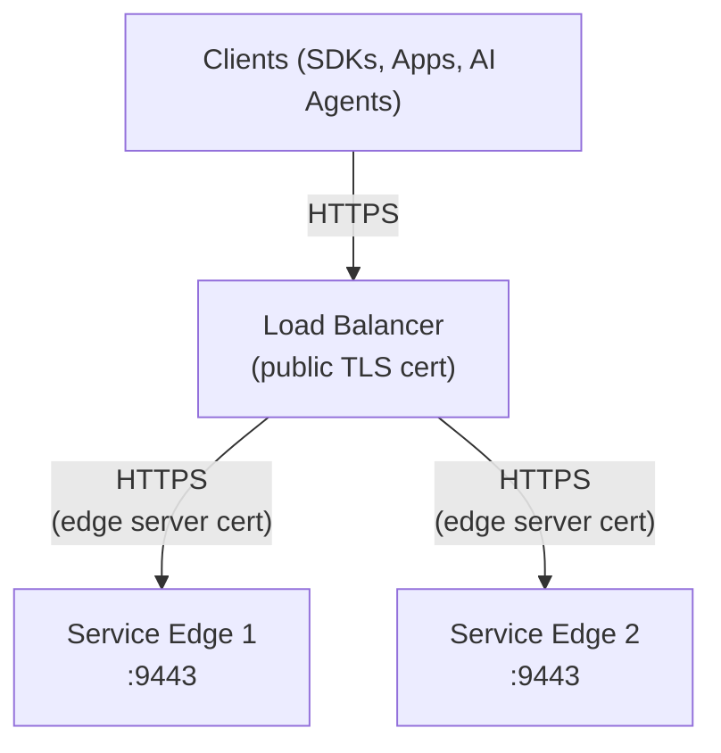

# TLS and Load Balancing Guide

How to configure end-to-end encryption and load balance Service Edge instances — whether deployed on-premise, in the cloud, or on a PaaS platform.

## Certificate Architecture

During bootstrap enrollment, each Service Edge instance receives **two certificate pairs**:

| Certificate | Files | Purpose |
|-------------|-------|---------|
| **Client cert** | `client.crt` / `client.key` | Authenticates the edge to the Ferentin control plane (mTLS) |
| **Server cert** | `server.crt` / `server.key` | Encrypts traffic on the HTTPS listener (port 9443) |

- **Client certs** renew automatically at 80% of lifetime. If the cert expires, the edge shuts down.
- **Server certs** provide encryption only. They are signed by the Ferentin Edge CA (not a public CA). An expired server cert still encrypts traffic — only verification fails, not encryption.
- **Never share certificates** between edge instances. Each instance has its own identity.

## Load Balancing Multiple Edges

For high availability, deploy multiple edge instances behind a reverse proxy at each site. The load balancer terminates the public TLS certificate and re-encrypts to the edges — the path is encrypted end-to-end.



**Key points**:
- Each edge enrolls separately with its own enrollment token
- Sticky sessions are not required — edges are stateless
- Health checks should target port **9080** (`/actuator/health`), not the TLS port
- Skip backend cert verification (the edge's server cert is signed by the Ferentin Edge CA, not a public CA) — the connection is still encrypted

## Cloud and PaaS Deployments

### Managed Load Balancers (AWS, GCP, Azure)

Cloud providers offer managed load balancers that support backend TLS natively. No special edge configuration is needed — just point the load balancer at port 9443 with HTTPS.

| Provider | Load Balancer | Backend TLS | Configuration |
|----------|--------------|-------------|---------------|
| **AWS** | Application Load Balancer (ALB) | HTTPS target group on port 9443 | ALB does not verify backend certs by default |
| **GCP** | Cloud Load Balancing | HTTPS backend service on port 9443 | Set health check to HTTP:9080 |
| **Azure** | Application Gateway | HTTPS backend pool on port 9443 | Upload Edge CA as trusted root, or use "well known CA" = No |

For all providers:
- **Target/backend port**: 9443 (HTTPS)
- **Health check port**: 9080 (HTTP)
- **Health check path**: `/actuator/health`
- **Backend cert verification**: Not required (Edge CA is not a public CA). The connection is still encrypted.

### PaaS Platforms (Fly.io, Railway, Render)

PaaS platforms handle TLS termination automatically — they provision a public certificate for your domain and route traffic to your container.

| Platform | How it works |
|----------|-------------|
| **Fly.io** | Terminates TLS at the edge. Set `internal_port = 9443` in `fly.toml`. Fly connects to your container over the private network — enable `TLS_ENABLED=true` for encryption on this leg. |
| **Railway** | Terminates TLS automatically. Expose port 9443 and Railway routes HTTPS traffic to it. |
| **Render** | Terminates TLS automatically. Configure the service with port 9443. |

On PaaS, you typically run a single edge instance per service. For high availability, deploy multiple services and use the platform's built-in load balancing or DNS-based failover.

## Self-Managed Reverse Proxies

### Nginx

```nginx
upstream service-edge {
    server edge-1:9443 max_fails=3 fail_timeout=30s;
    server edge-2:9443 max_fails=3 fail_timeout=30s;
}

server {
    listen 443 ssl;
    server_name ai-gateway.example.com;

    ssl_certificate     /etc/nginx/certs/public.crt;
    ssl_certificate_key /etc/nginx/certs/public.key;

    location / {
        proxy_pass https://service-edge;
        proxy_ssl_verify off;
        proxy_ssl_protocols TLSv1.3;
        proxy_ssl_session_reuse on;

        proxy_set_header Host $host;
        proxy_set_header X-Real-IP $remote_addr;
        proxy_set_header X-Forwarded-For $proxy_add_x_forwarded_for;
        proxy_set_header X-Forwarded-Proto $scheme;

        # Required for SSE streaming (MCP, chat completions)
        proxy_buffering off;
        proxy_cache off;
        proxy_read_timeout 300s;
    }
}
```

### HAProxy

```
frontend ai-gateway
    bind *:443 ssl crt /etc/haproxy/certs/public.pem
    default_backend edges

backend edges
    balance roundrobin
    option httpchk GET /actuator/health
    http-check expect status 200
    server edge-1 edge-1:9443 ssl verify none check port 9080
    server edge-2 edge-2:9443 ssl verify none check port 9080
```

### Caddy

```
ai-gateway.example.com {
    reverse_proxy edge-1:9443 edge-2:9443 {
        lb_policy round_robin
        transport http {
            tls
            tls_insecure_skip_verify
        }
        health_uri /actuator/health
        health_port 9080
        health_interval 30s
    }
}
```

### Envoy

Use an upstream TLS context with `trust_chain_verification: ACCEPT_UNTRUSTED` on the cluster pointing to port 9443, and HTTP health checks on port 9080. See the [Envoy TLS upstream documentation](https://www.envoyproxy.io/docs/envoy/latest/intro/arch_overview/security/ssl) for details.

## TLS Passthrough (Alternative)

If you don't need the load balancer to inspect HTTP headers, you can pass TLS connections through directly (L4). The edge's own server certificate is presented to clients.

**Nginx stream**:
```nginx
stream {
    upstream service-edge {
        server edge-1:9443;
        server edge-2:9443;
    }
    server {
        listen 9443;
        proxy_pass service-edge;
    }
}
```

**Tradeoff**: No path-based routing, no header injection, TCP-only health checks.

**Bonus**: TLS passthrough preserves end-to-end HTTP/2 negotiation. Clients ALPN-negotiate directly with the edge, so HTTP/2 multiplexing wins are not gated on whether your reverse proxy supports backend HTTP/2.

## HTTP/2 and ALPN

The edge negotiates HTTP/2 over TLS via ALPN by default — both for inbound traffic on `:9443` and for outbound calls to LLM providers and MCP servers. ALPN handles per-peer compatibility automatically: peers that don't advertise h2 fall back to HTTP/1.1 transparently, with no client breakage.

### Where it's enabled

| Direction | What gets HTTP/2 | Default |
|---|---|---|
| **Inbound** — clients → edge `:9443` | TLS server advertises `h2, http/1.1` via ALPN; Reactor-Netty server accepts both | `true` |
| **Outbound LLM** — edge → Anthropic, OpenAI, Bedrock, Vertex, Azure, AI Studio, xAI, Mistral | The HttpClient negotiates h2 first; ALPN falls back per provider | `true` |
| **Outbound MCP** — edge → customer-configured MCP servers | The HttpClient (public + edge-routed paths) negotiates h2 first | `true` |

Telemetry to the Ferentin control plane is gRPC, which is HTTP/2 by spec — separate path, always on.

### Why HTTP/2 helps for AI traffic

For high-fanout agent workloads, the wins are real:

- **Connection multiplexing.** A single TCP+TLS connection per LLM provider serves many concurrent tool calls instead of a separate handshake per request. Massive amortization of the TLS-handshake cost.
- **HPACK header compression.** Repeated `Authorization: Bearer …` (LLM API keys are typically 1-2KB), `MCP-Session-Id`, `MCP-Protocol-Version`, and `traceparent` headers compress to 1-2 bytes after the first call on a connection.
- **Stream-level cancellation.** A user abandoning a streaming chat completion sends `RST_STREAM` — only that one stream cancels, sibling requests on the same connection keep flowing.

Wins scale with concurrency. Single-shot chat is roughly unchanged; agents with many parallel tool calls win big.

### Kill switches

Both directions have an independent override env var. Defaults are `true` (HTTP/2 enabled).

| Variable | Default | What it controls |
|---|---|---|
| `FERENTIN_EDGE_TLS_HTTP2_ENABLED` | `true` | Inbound `:9443` listener. Clients fall back to HTTP/1.1 when set to `false`. |
| `FERENTIN_EDGE_UPSTREAM_HTTP2_ENABLED` | `true` | Outbound LLM + MCP calls. |

```yaml
# docker-compose.yml fragment
environment:
  FERENTIN_EDGE_TLS_HTTP2_ENABLED: "false"        # disable inbound h2
  FERENTIN_EDGE_UPSTREAM_HTTP2_ENABLED: "false"   # disable outbound h2
```

### When to disable

| Scenario | Action |
|---|---|
| Reverse proxy in front of the edge mishandles h2 backend traffic | Disable `FERENTIN_EDGE_TLS_HTTP2_ENABLED`. Keep h2 between client and proxy; use HTTP/1.1 between proxy and edge. |
| Specific MCP server in your fleet advertises h2 but breaks under it | Rare in 2026. Disable `FERENTIN_EDGE_UPSTREAM_HTTP2_ENABLED` as a kill switch while you contact the vendor. |
| SSE streaming responses arrive in chunks instead of incrementally | Possible h2 frame buffering. Try disabling inbound first; if it persists, disable outbound. |
| Capturing pristine HTTP/1.1 traces for debugging | Disable both temporarily. |

### Reverse proxy interaction

When the edge sits behind a self-managed reverse proxy or cloud load balancer, **end-to-end HTTP/2 requires the proxy to also speak h2 on the backend leg.** Default behavior varies:

| Proxy | Default backend protocol | h2 backend support |
|---|---|---|
| **nginx** (`proxy_pass`) | HTTP/1.1 | Limited — `proxy_http_version 2.0` is not standard; use `grpc_pass` for h2 instead |
| **HAProxy** | HTTP/1.1 | `proto h2` on `server` line enables h2 backend |
| **Envoy** | HTTP/2 native | Built-in h2 upstream cluster support |
| **Caddy** | HTTP/1.1 | `transport http { versions h2 }` enables h2 backend |
| **AWS ALB** | HTTP/1.1 | No h2 backend today (client → ALB can be h2; ALB → target is h1.1) |
| **GCP Cloud Load Balancing** | HTTP/2 if the backend service is set to `HTTP2` | Configurable per backend service |

The wins between client and proxy still apply when the proxy↔edge leg is HTTP/1.1 — the proxy multiplexes its own connection pool. **TLS passthrough (L4)** is the simplest path to end-to-end h2 if you don't need L7 features at the proxy.

### What you'll see in logs

At startup, the edge logs the active protocol mode for each direction:

```
LLM HttpClient (service-edge) configured with per-request trust dispatch — strict default, insecure path opt-in via edge_site.verify_upstream_tls=false; h2 upstream enabled (ALPN H2/HTTP11; falls back per-server)
MCP upstream HttpClient configured — h2 enabled (ALPN H2/HTTP11; falls back per-server)
```

The phrase `enabled (ALPN H2/HTTP11; falls back per-server)` confirms the kill switch is OFF (h2 active). When disabled you'll see `disabled (HTTP/1.1 only)` instead.

### Verifying HTTP/2 on the wire

**Inbound**:

```bash
# Negotiate HTTP/2 against the edge listener
curl -k --http2 -v https://your-edge.example.com/actuator/health 2>&1 | grep -E 'ALPN|HTTP/2'
# expected: ALPN: server accepted h2 / < HTTP/2 200

# HTTP/1.1 fallback still works regardless of the kill switch
curl -k --http1.1 https://your-edge.example.com/actuator/health
# expected: 200 OK
```

**Outbound**: capture a `tcpdump` on egress and look for the HTTP/2 connection preface (`PRI * HTTP/2.0`) followed by a SETTINGS frame, or enable Reactor-Netty wiretap logging at DEBUG.

### What HTTP/2 does NOT help with

- **TCP head-of-line blocking under packet loss** — that's HTTP/3 / QUIC's domain. HTTP/2 still suffers (sometimes worse, since all streams share one TCP connection).
- **Single-shot non-concurrent traffic** — one user, one chat completion: HTTP/2 saves you the connection handshake on the second request via the same connection, but otherwise the latency is the same.
- **WebSocket-over-HTTP/2** — the edge does not enable RFC 8441 Extended CONNECT. WebSocket clients fall back to HTTP/1.1 cleanly.

## HTTP/2 SETTINGS — defaults and sizing

The edge advertises Reactor-Netty's HTTP/2 SETTINGS defaults to inbound clients. These are RFC 9113-conservative values that fit the vast majority of deployments. There is no Spring property for tuning them today — operators should size container memory against the formulas below, and only tune if traffic-shape signals warrant it.

### Defaults (inbound port 9443)

| SETTINGS parameter | Default | What it controls |
|--------------------|---------|------------------|
| `MAX_CONCURRENT_STREAMS` | `100` | Max streams a single client may open on one h2 connection |
| `INITIAL_WINDOW_SIZE` | `65535` (64 KB) | Per-stream receive window before flow-control backpressure |
| `MAX_FRAME_SIZE` | `16384` (16 KB) | Maximum payload per HTTP/2 frame |
| `HEADER_TABLE_SIZE` | `4096` (4 KB) | HPACK dynamic table size — controls header compression |
| `MAX_HEADER_LIST_SIZE` | unbounded | Total decompressed header bytes per request |
| `ENABLE_PUSH` | `0` | Server push (deprecated; disabled) |

### Memory sizing formula

Approximate peak memory per saturated HTTP/2 connection:

```
peak per connection ≈ MAX_CONCURRENT_STREAMS × (INITIAL_WINDOW_SIZE + per-stream overhead ~4 KB)
                    + 2 × HEADER_TABLE_SIZE
```

Worked examples:

| Configuration | Per saturated connection | At 1000 concurrent connections (upper bound) |
|---|---|---|
| **Defaults** (100 × 64 KB + 8 KB) | ~6.8 MB | ~6.8 GB |
| 256 × 64 KB | ~17 MB | ~17 GB |
| 100 × 1 MB window | ~100 MB | ~100 GB |
| 512 × 256 KB window | ~128 MB | ~128 GB |

Real traffic rarely saturates every stream on every connection at once — practical peak is typically 30-50% of the upper bound. Container `--memory` limits should accommodate the upper bound at expected peak concurrency.

### Container sizing (default settings)

For the shipped image with default HTTP/2 SETTINGS:

| Workload | Concurrent connections | Container memory recommendation |
|---|---|---|
| Single-tenant low-volume LLM gateway | 50-100 | 2 GB (HTTP/2 buffers ≪ JVM heap) |
| Multi-tenant LLM + MCP gateway | 200-500 | 4 GB |
| Heavy agent workload, many parallel sessions | 500-1500 | 8 GB |
| Edge in front of large customer pool with bursty traffic | 1500+ | 16 GB |

**HTTP/2 buffers are usually a small fraction of total memory** — JVM heap (model catalog, policy bundles, JWT cache) dominates at moderate volumes. The HTTP/2 buffer footprint becomes meaningful only at >2000 concurrent connections or with bumped SETTINGS.

### CPU sizing

HTTP/2 multiplexing CPU is dominated by request handling on the edge — TLS handshakes, JSON parsing, policy evaluation, upstream round-trips. The protocol overhead itself is sublinear:

| Setting change | CPU impact at saturation |
|---|---|
| `MAX_CONCURRENT_STREAMS` 100 → 512 | <5% additional CPU (multiplexing is light) |
| `HEADER_TABLE_SIZE` 4 KB → 64 KB | Slight encode/decode cost, much bigger wire savings on repeated headers — net positive |
| `MAX_FRAME_SIZE` 16 KB → 128 KB | Lower framing CPU, larger buffers — wash on net |

For LLM/MCP workloads, CPU sizing is governed by request rate × per-request handler cost, not by protocol settings.

### When to tune

Tune ONLY if you observe one of these operational signals:

| Signal | Recommended setting change | Memory impact |
|---|---|---|
| Client-side logs report `REFUSED_STREAM` with high parallel-tool-call workloads | Bump `MAX_CONCURRENT_STREAMS` to 256 or 512 | Linear; see formula |
| Streaming completions stall mid-response, `WINDOW_UPDATE` frames visible in tcpdump | Bump `INITIAL_WINDOW_SIZE` to 256 KB | Multiplied by max streams — be cautious |
| HPACK compression miss rate >20% (requires metric instrumentation) | Bump `HEADER_TABLE_SIZE` to 16-64 KB | Doubles cost (encoder + decoder), usually still a wire-byte win |
| Single requests carry >100 KB frames (rare for LLM/MCP) | Bump `MAX_FRAME_SIZE` to 64-128 KB | Larger receive buffer per stream |

**Default should hold for ~99% of workloads.** The most likely real-world tuning is `MAX_CONCURRENT_STREAMS` for high-fanout agent traffic. Most edge deployments will never need to touch any of these.

### How to tune today

No Spring property is exposed for HTTP/2 SETTINGS. Tuning requires building a custom image with a code change in `TlsListenerService.bindHttpServer()`:

```java
.protocol(HttpProtocol.H2, HttpProtocol.HTTP11)
.http2Settings(spec -> spec
    .maxConcurrentStreams(256)
    .initialWindowSize(65535)
    .headerTableSize(16 * 1024))
```

If your workload needs ongoing tuning, file an issue with the operational signal — adding a `ferentin.edge.tls.http2.*` property block is small. We just don't ship pre-tuning knobs without traffic data showing they're needed.
