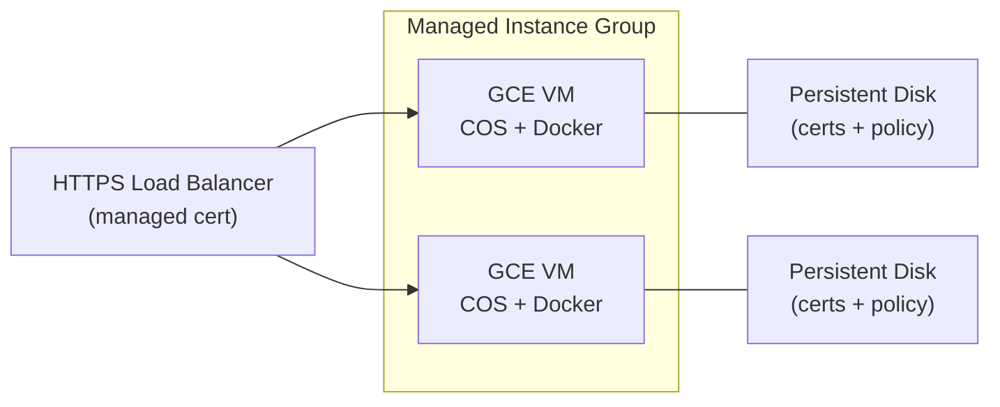

# GCE / MIG Deployment

Deploy Ferentin Service Edge to a Google Compute Engine VM, or to a Managed Instance Group (MIG) for HA.

The recipe uses **Container-Optimized OS (COS)** which boots a Docker container declared in instance metadata — no SSH-and-install steps. For HA, the same instance template backs a regional MIG with health-check-driven autohealing.

> Use [`../gke/`](../gke/) instead if you already run GKE — it has better operational primitives (Workload Identity, BackendConfig, rolling restarts). GCE/MIG is the right choice when you need VM-level isolation, run a non-Kubernetes shop, or have specific GCE-only networking requirements.

## Prerequisites

- `gcloud` CLI authenticated and pointed at your project.
- A **GCP service account** for the VM's runtime identity. If you'll use Vertex AI providers, this SA needs `roles/aiplatform.user`.
- A **Persistent Disk** for the cert and policy volumes (or the recipe creates ones for you).

## What this exposes

Once enrolled, the Service Edge serves both LLM and MCP traffic on port **9443** (HTTPS) on each VM:

| Capability | Endpoints |
|---|---|
| **LLM Proxy** | `/v1/chat/completions`, `/v1/messages`, `/v1/models`, `/v1/embeddings` |
| **MCP Gateway** | `/v1/mcp/{server-slug}` — Streamable HTTP transport, [2025-11-25 spec](https://modelcontextprotocol.io/specification/2025-11-25) |

## Architecture



Each VM enrolls independently with its own enrollment token and persists certs to a per-VM persistent disk. The HTTPS LB front-ends the MIG with a Google-managed public cert and health-checks port 9080.

## Quick Start (single VM)

For a single-VM deployment without MIG complexity:

### 1. Create the runtime SA

```bash
PROJECT_ID=your-project
ZONE=us-central1-a

gcloud iam service-accounts create ferentin-edge-runtime \
  --display-name="Ferentin Edge — GCE runtime identity"

gcloud projects add-iam-policy-binding $PROJECT_ID \
  --member="serviceAccount:ferentin-edge-runtime@$PROJECT_ID.iam.gserviceaccount.com" \
  --role="roles/aiplatform.user"
```

### 2. Get an enrollment token

From the [admin console](https://admin.ferentin.net/manage/edges/new). Copy it for use below.

### 3. Generate a passphrase

```bash
PASSPHRASE=$(openssl rand -base64 48 | tr -d '\n')
echo "Save this passphrase — if lost, the edge must re-enroll: $PASSPHRASE"
```

### 4. Create the VM

```bash
ENROLL_TOKEN='<paste from admin console>'

gcloud compute instances create-with-container service-edge-1 \
  --project=$PROJECT_ID \
  --zone=$ZONE \
  --machine-type=e2-standard-2 \
  --image-family=cos-stable \
  --image-project=cos-cloud \
  --container-image=ghcr.io/ferentin-net/service-edge:0.5.5 \
  --service-account=ferentin-edge-runtime@$PROJECT_ID.iam.gserviceaccount.com \
  --scopes=cloud-platform \
  --tags=ferentin-edge \
  --container-restart-policy=always \
  --container-stdin \
  --container-arg='--security-opt' --container-arg='no-new-privileges:true' \
  --container-arg='--cap-drop' --container-arg='ALL' \
  --container-mount-host-path=mount-path=/opt/ferentin/certs,host-path=/mnt/disks/certs,mode=rw \
  --container-mount-host-path=mount-path=/opt/ferentin/policy,host-path=/mnt/disks/policy,mode=rw \
  --container-mount-host-path=mount-path=/opt/ferentin/logs,host-path=/var/log/ferentin,mode=rw \
  --container-env=ENROLLMENT_TOKEN="$ENROLL_TOKEN" \
  --container-env=FERENTIN_KEY_PASSPHRASE="$PASSPHRASE" \
  --container-env=SPRING_PROFILES_ACTIVE=aws-secure \
  --container-env=TLS_ENABLED=true \
  --container-env=TLS_PORT=9443 \
  --metadata=startup-script='#!/bin/bash
mkdir -p /mnt/disks/certs /mnt/disks/policy /var/log/ferentin
chown -R 1000:1000 /mnt/disks/certs /mnt/disks/policy /var/log/ferentin'

# Allow inbound HTTPS on 9443 (and optionally 9080 for internal health checks)
gcloud compute firewall-rules create allow-ferentin-edge \
  --network=default \
  --action=ALLOW \
  --direction=INGRESS \
  --target-tags=ferentin-edge \
  --rules=tcp:9443
```

### 5. Verify

```bash
EXTERNAL_IP=$(gcloud compute instances describe service-edge-1 \
  --zone=$ZONE --format='value(networkInterfaces[0].accessConfigs[0].natIP)')

# SSH into the VM and check container status
gcloud compute ssh service-edge-1 --zone=$ZONE -- \
  'docker ps && docker logs $(docker ps -q --filter ancestor=ghcr.io/ferentin-net/service-edge:0.5.5 2>&1 | grep TlsListenerService'

# Test from outside (if cert verification is set up)
curl --cacert ferentin-ca.pem https://$EXTERNAL_IP:9443/v1/models
```

## Production: Managed Instance Group + HTTPS LB

For HA, use an instance template + regional MIG + HTTPS LB:

### 1. Create an instance template

```bash
PROJECT_ID=your-project
REGION=us-central1

# Each VM enrolls independently — create a separate enrollment token per VM
# OR use a single token (single-use, 15-min TTL) and accept that only the first
# VM in the MIG will enroll successfully. The recommended pattern is to
# pre-enroll each VM via SSH then bake the resulting certs into the template.
#
# For dynamic enrollment in a MIG, use a startup script that pulls the
# enrollment token from Secret Manager (regenerated per-VM via Cloud Function
# or similar). This is out of scope for the basic recipe.

gcloud compute instance-templates create-with-container ferentin-edge-tmpl \
  --machine-type=e2-standard-2 \
  --image-family=cos-stable \
  --image-project=cos-cloud \
  --container-image=ghcr.io/ferentin-net/service-edge:0.5.5 \
  --service-account=ferentin-edge-runtime@$PROJECT_ID.iam.gserviceaccount.com \
  --scopes=cloud-platform \
  --tags=ferentin-edge \
  --container-restart-policy=always \
  --container-mount-host-path=mount-path=/opt/ferentin/certs,host-path=/mnt/disks/certs,mode=rw \
  --container-mount-host-path=mount-path=/opt/ferentin/policy,host-path=/mnt/disks/policy,mode=rw \
  --container-env=SPRING_PROFILES_ACTIVE=aws-secure \
  --container-env=TLS_ENABLED=true \
  --container-env=TLS_PORT=9443 \
  --metadata-from-file=startup-script=startup-script.sh
```

The `startup-script.sh` should:
1. Mount or format the persistent disk under `/mnt/disks/certs` and `/mnt/disks/policy`.
2. Pull `ENROLLMENT_TOKEN` and `FERENTIN_KEY_PASSPHRASE` from Secret Manager.
3. `chown -R 1000:1000 /mnt/disks/*`.

A starter is provided in [`startup-script.sh`](startup-script.sh).

### 2. Create the MIG

```bash
gcloud compute instance-groups managed create ferentin-edge-mig \
  --base-instance-name=service-edge \
  --size=2 \
  --template=ferentin-edge-tmpl \
  --region=$REGION \
  --health-check=ferentin-edge-hc \
  --initial-delay=300

# Health check on the HTTP listener (9080) — binds at startup, unlike 9443
gcloud compute health-checks create http ferentin-edge-hc \
  --port=9080 \
  --request-path=/actuator/health/liveness \
  --check-interval=15s \
  --timeout=10s \
  --healthy-threshold=2 \
  --unhealthy-threshold=3
```

### 3. Front with HTTPS Load Balancer

Use the GCP Console or the [HTTPS LB + MIG quickstart](https://cloud.google.com/load-balancing/docs/https/setup-global-ext-https-compute) — the steps are: backend service pointing at the MIG → URL map → HTTPS proxy with Google-managed cert → forwarding rule to a public IP.

```bash
# Create the backend service
gcloud compute backend-services create ferentin-edge-backend \
  --protocol=HTTPS \
  --port-name=https \
  --health-checks=ferentin-edge-hc \
  --global \
  --enable-cdn=false

# Add the MIG as a backend (set port 9443 named-port on the MIG first)
gcloud compute instance-groups managed set-named-ports ferentin-edge-mig \
  --region=$REGION \
  --named-ports=https:9443

gcloud compute backend-services add-backend ferentin-edge-backend \
  --instance-group=ferentin-edge-mig \
  --instance-group-region=$REGION \
  --global

# URL map → target proxy → forwarding rule → managed cert → DNS
# (See the GCP HTTPS LB quickstart for the remaining steps.)
```

The LB does NOT need to verify the edge's server cert — Ferentin's edge CA is not a public CA, but the connection is still encrypted. Set `--no-validate-ssl-policy` or use the equivalent backend-service flag. See [`../TLS.md`](../TLS.md) for the full pattern.

## Image-tag updates and rolling restarts

```bash
# Update the instance template to a new image tag (substitute your target version)
gcloud compute instance-templates create-with-container ferentin-edge-tmpl-2 \
  --container-image=ghcr.io/ferentin-net/service-edge:<NEW_VERSION> \
  ...same flags as above...

# Rolling update on the MIG
gcloud compute instance-groups managed rolling-action start-update ferentin-edge-mig \
  --version=template=ferentin-edge-tmpl-2 \
  --region=$REGION \
  --max-surge=1 \
  --max-unavailable=0
```

## See also

- [`../gke/`](../gke/) — Recommended for production GCP deployments
- [`../cloud-run/`](../cloud-run/) — Serverless option, simpler ops but single-revision constraint
- [`../TLS.md`](../TLS.md) — Load-balancer configuration patterns
- Main [README](../README.md) — env-var tables, tag granularities, troubleshooting
